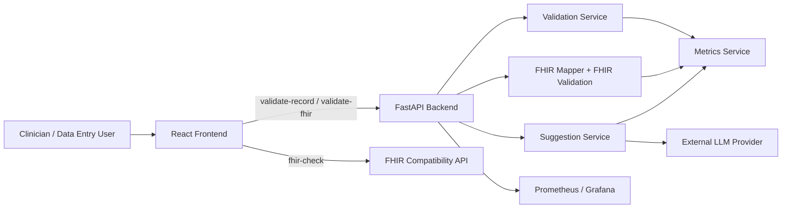

# SchemaGuard Health AI

SchemaGuard Health AI is a FastAPI + React system for validating patient data, building FHIR R4 resources, and guiding clinicians or implementers toward cleaner OpenMRS and ABDM-aligned records.

It is built around one idea: keep the base validation deterministic and lightweight, then use AI only as an assistive layer when the record needs a fix.

## What the project does

- Validates patient records with profile-aware rules.
- Builds FHIR Patient, Observation, Bundle, and OpenMRS mapping previews in the browser.
- Surfaces quality issues with a live score.
- Generates AI suggestions only when the data actually needs them.
- Lets the user apply a suggestion directly to the record and immediately see the score update.
- Exposes Prometheus metrics for monitoring.

## System idea

The application is designed for low-resource public health workflows where teams still need standards-compliant data.

The backend acts as the source of truth for validation and scoring.
The frontend is an interactive data builder and review surface.
The AI layer is optional and only proposes corrections after the rules engine finds a gap.

That gives you three things at once:

1. deterministic validation,
2. explainable remediation,
3. FHIR-ready output that can be mapped into OpenMRS or other systems.

## Architecture



### Frontend

The frontend is a Vite + React + TypeScript app in [frontend/](frontend/).

It contains:

- a FHIR Patient builder,
- an Observation builder with terminology search,
- an AI Suggestions panel,
- a FHIRPath validation tree,
- a quality score gauge,
- an OpenMRS mapping preview,
- a FHIR resource summary viewer.

The frontend uses environment-driven FHIR server configuration and includes working HTTPS presets for HAPI FHIR, the OpenMRS demo, and SMART on FHIR.

### Backend

The backend is a FastAPI service in [app/](app/).

The main layers are:

- [app/main.py](app/main.py) for app bootstrap, middleware, CORS, gzip, and route registration.
- [app/routers/](app/routers/) for HTTP endpoints.
- [app/services/](app/services/) for validation, FHIR mapping, AI orchestration, and metrics.
- [app/schemas/](app/schemas/) for request and response models.
- [app/prompts/](app/prompts/) for editable AI prompt text.

### Concepts involved

- FHIR R4: the application builds Patient, Observation, and Bundle data structures.
- OpenMRS mapping: patient data is converted into a shape that can be sent to OpenMRS workflows.
- ABDM profile awareness: the validator can surface ABHA-related guidance when the patient record is expected to follow ABDM-style rules.
- Rule-based scoring: the score changes from validation findings, not from AI guessing.
- Assistive AI: suggestions are only a helper, not the source of truth.
- Observability: metrics are exposed for monitoring request volume and validation outcomes.

## API endpoints

### Validation

- `POST /validate-record`
  - Validates a legacy patient record.
  - Returns `quality_score`, `issues`, `fhir_compliant`, `patient`, `observations`, `bundle`, `openmrs_mapping`, and `suggestions`.
  - Used when the record is still in the simpler app-specific format.

- `POST /validate-fhir`
  - Validates a FHIR-native payload containing a Patient, Observation list, and optional Bundle.
  - Used when the frontend or an integration already has FHIR-shaped data.

### FHIR compatibility

- `POST /fhir-check`
  - Checks whether an input record can be mapped into a FHIR Patient payload.
  - Returns a compatibility result used by the frontend and integration flows.

### AI suggestions

- `POST /suggest-fixes`
  - Sends a record plus validation issues to the suggestion engine.
  - Returns structured fix suggestions with confidence, example payloads, and an action payload when available.

### Metrics and health

- `GET /metrics`
  - Returns Prometheus exposition text.

- `GET /health`
  - Returns service health and dependency status.

- `GET /docs`
  - FastAPI Swagger UI.

## How the AI helps

AI is not used to invent medical data or replace the rules engine.
It is used to explain and suggest a safe next step after validation finds a problem.

The suggestion flow works like this:

1. The user edits the patient form or builder.
2. The validator recalculates the score immediately.
3. If the record is missing something important, the Suggestions panel shows a targeted fix.
4. The user can click Apply to merge the fix into the record.
5. The score updates right away after the fix is applied.

This is especially visible for ABHA / ABDM-related guidance.
When an ABDM-style patient profile is missing an ABHA identifier, the UI shows an ABHA-focused suggestion.
For other non-ABDM FHIR profiles, that ABHA-specific suggestion does not appear.

That keeps the AI behavior context-aware instead of noisy.

## Frontend walkthrough

### Patient builder

The Patient Builder is a form-like workspace for editing:

- patient ID,
- gender,
- birth date,
- marital status,
- identifiers,
- names,
- telecoms,
- addresses,
- contacts,
- communications.

It is structured as a multi-section form with repeatable cards for identifiers and names, which makes the builder feel closer to a clinical entry screen than a raw JSON editor.

### Observation builder

The Observation Builder lets you:

- create blood pressure observations,
- search terminology locally,
- choose a code from the match list,
- preview the selected code in a human-readable summary,
- add custom coded observations,
- remove observations and instantly see validation and score changes.

The builder is laid out in sections for blood pressure, terminology search, and the active observation list.

### AI suggestion panel

The Suggestions panel shows:

- the affected field,
- a confidence value,
- a short natural-language explanation,
- an example payload,
- an Apply button.

For the ABHA suggestion shown in the screenshots, the panel presents the identifier system and a sample value, and the Apply button can insert it directly.

### Quality score and validation

The score gauge summarizes record quality in one place.

In the current UX, removing a required FHIR element can immediately lower the score and trigger a matching suggestion.
Applying the suggestion restores the missing data and the score updates immediately.

That makes the score feel live and accurate instead of static.

### FHIR resource viewer

The resource viewer summarizes the bundle contents rather than dumping raw JSON.

It shows:

- patient summary,
- observation count,
- bundle type,
- a compact entry list for each bundled resource.

### FHIR server picker

The frontend uses real HTTPS test endpoints instead of fictional URLs.

Available presets:

- HAPI FHIR Public Test: `https://hapi.fhir.org/baseR4`
- OpenMRS Official Demo: `https://openmrs-spa.org/openmrs/ws/fhir2/R4`
- SMART on FHIR Sandbox: `https://fhir.smarthealthit.org`

The UI validates the entered URL and warns if the value is not HTTPS or if a localhost URL is used in production builds.

## Repository structure

- [app/main.py](app/main.py) bootstraps the FastAPI app.
- [app/routers/](app/routers/) contains HTTP endpoints.
- [app/services/](app/services/) contains validation, mapping, AI, and metrics logic.
- [app/schemas/](app/schemas/) defines request and response models.
- [frontend/](frontend/) contains the React UI and its builders.
- [loadtests/](loadtests/) contains Locust load test scripts.
- [observability/](observability/) contains Prometheus and Grafana config.
- [tests/](tests/) contains backend test coverage.

## OpenMRS integration idea

The intended flow is:

1. A user edits patient data in OpenMRS or in the SchemaGuard UI.
2. The backend validates the data and calculates the quality score.
3. If data is incomplete, the AI suggestion engine proposes a safe fix.
4. The clinician or implementer applies the fix.
5. The record can then be mapped into FHIR or OpenMRS workflows.

This pattern is useful because it keeps the operational system conservative while still making the data entry experience smarter.

## Quick start

### Docker

```bash
docker compose up --build
```

Then open:

- `http://localhost:8000/docs`
- `http://localhost:5173`
- `http://localhost:9090`
- `http://localhost:3000`

### Local development

Backend:

```bash
python3 -m venv venv
source venv/bin/activate
pip install -r requirements.txt
python3 -m app.main
```

Frontend:

```bash
cd frontend
npm install
npm run dev
```

## Sample requests

### Validate a patient record

```bash
curl -X POST http://localhost:8000/validate-record \
	-H 'Content-Type: application/json' \
	-d '{"id":"pat-001","name":"Asha Devi","age":42,"gender":"female","vitals":{},"diagnoses":[]}'
```

### Ask for suggestions

```bash
curl -X POST http://localhost:8000/suggest-fixes \
	-H 'Content-Type: application/json' \
	-d '{"record":{"age":150},"issues":["Age must be between 0 and 120"]}'
```

### Check FHIR compatibility

```bash
curl -X POST http://localhost:8000/fhir-check \
	-H 'Content-Type: application/json' \
	-d '{"record":{"id":"pat-001","name":"Asha Devi","age":42,"gender":"female"}}'
```

## Metrics and observability

The service exposes Prometheus-compatible metrics and is wired for Grafana dashboards.

- `observability/prometheus.yml` configures scraping.
- `observability/grafana/` provisions dashboards and datasources.
- `docker-compose.yml` exposes Prometheus on `9090` and Grafana on `3000`.

## Testing

```bash
python3 -m pytest -q tests
```

For linting and formatting:

```bash
pip install -r requirements-dev.txt
black --check app tests
flake8 app tests
```

For load testing:

```bash
locust -f loadtests/locustfile.py --host http://localhost:8000
```

## Notes

- The AI layer is optional and can be disabled by leaving `LLM_API_KEY` unset.
- FHIR and ABDM guidance is profile-aware, so ABHA suggestions appear only when the record context calls for them.
- The frontend is meant to look and feel like a clinical builder, not a raw JSON editor.

## Troubleshooting

- If AI suggestions are unavailable, check that `LLM_API_KEY` is set and reachable from the container.
- If FHIR validation fails on a valid-looking record, inspect the mapped payload in [app/services/fhir_mapper.py](app/services/fhir_mapper.py).
- If the frontend warns about the server URL, use one of the HTTPS presets or set `VITE_FHIR_SERVER_URL`.
- If `/docs` does not load, confirm the container started successfully and that the app is listening on `0.0.0.0:8000`.
