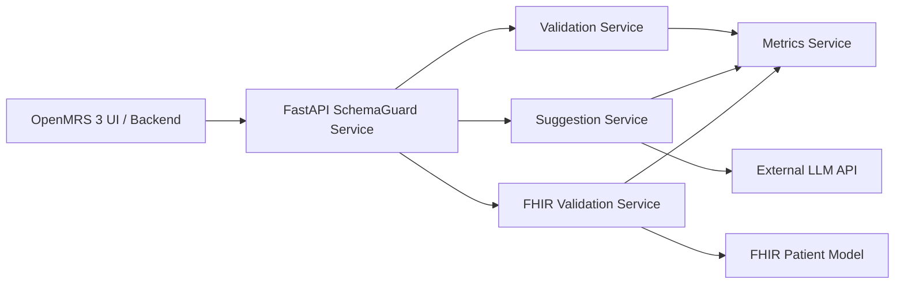

# SchemaGuard Health AI

SchemaGuard Health AI is a FastAPI microservice for validating, enriching, and suggesting fixes for healthcare records in low-resource public health workflows. It is designed to plug into OpenMRS 3 as a companion service for quality checks, FHIR compatibility validation, and AI-assisted suggestions.

## What’s Included

- FastAPI backend for high-performance validation and FHIR mapping.
- **Stylish & Responsive UI**: Premium glassmorphic React frontend with real-time feedback.
- **AI-Assisted Fixes**: Intelligent suggestion engine via **Groq (Llama 3)** integration.
- **FHIR Interoperability**: Automatic mapping to FHIR R4 Patient resources.
- **Lightweight Observability**: Built-in Prometheus metrics and pre-configured Grafana dashboards.
- **Deployment Ready**: Optimized for both Docker and local high-speed development.

## Architecture



The codebase follows a clean structure:

- `app/main.py` for app setup, middleware, and router registration.
- `app/routers/` for HTTP endpoints.
- `app/services/` for validation, FHIR mapping, metrics, and AI orchestration.
- `app/prompts/` for editable LLM prompts.
- `frontend/` for the Vite + React + TypeScript UI.
- `loadtests/` for Locust scenarios and scripts.
- `observability/` for Prometheus and Grafana configuration.
- `.github/workflows/` for CI automation.
- `tests/` for endpoint and service coverage.

## Endpoints

- `POST /validate-record` validates a patient record and returns a quality score, issue list, and FHIR compliance flag.
- `POST /suggest-fixes` generates structured AI suggestions from raw record data and validation issues.
- `POST /fhir-check` maps a record to a FHIR Patient resource and validates it with `fhir.resources`.
- `GET /metrics` returns Prometheus exposition text for Grafana/Prometheus scraping.
- `GET /health` returns dependency status for LLM, FHIR validation, and database readiness.
- `GET /docs` exposes Swagger UI.

## Quick Start

### Prerequisites

On a Linux machine, install Docker Engine and the Compose plugin first, then verify the daemon is running:

```bash
docker --version
docker compose version
docker run --rm hello-world
```

### Docker

```bash
docker compose up --build
```

Then open:

- `http://localhost:8000/docs` for the API docs
- `http://localhost:5173` for the frontend
- `http://localhost:9090` for Prometheus
- `http://localhost:3000` for Grafana

### Full Stack

The `docker-compose.yml` file starts the API, frontend, Prometheus, Grafana, and Locust services together.

- Start the core stack with `docker compose up --build`.
- Run the load-test container with `docker compose --profile loadtest up --build locust`.
- Stop everything with `docker compose down`.

If you only want the API and frontend, you can run the same `docker compose up --build` command and ignore the observability URLs.

### Local Development (High Speed)
1. **Backend**:
   ```bash
   python3 -m venv venv
   source venv/bin/activate
   pip install -r requirements.txt
   python3 -m app.main
   ```
2. **Frontend**:
   ```bash
   cd frontend
   npm install
   npm run dev
   ```

## Sample Requests

### Validate a patient record

```bash
curl -X POST http://localhost:8000/validate-record \
	-H 'Content-Type: application/json' \
	-d '{"id":"pat-001","name":"Asha Devi","age":42,"gender":"female","vitals":{},"diagnoses":[]}'
```

### Ask for suggestions

```bash
curl -X POST http://localhost:8000/suggest-fixes \
	-H 'Content-Type: application/json' \
	-d '{"record":{"age":150},"issues":["Age must be between 0 and 120"]}'
```

### Check FHIR compatibility

```bash
curl -X POST http://localhost:8000/fhir-check \
	-H 'Content-Type: application/json' \
	-d '{"record":{"id":"pat-001","name":"Asha Devi","age":42,"gender":"female"}}'
```

## OpenMRS 3 Integration Notes

### Backend pattern

OpenMRS 3 can call this service from a backend module or middleware layer when a patient form is saved. The backend should:

1. Convert OpenMRS patient payloads into the service request format.
2. Call `POST /validate-record` before persisting or synchronizing data.
3. Call `POST /fhir-check` when exporting to FHIR/ABDM workflows.
4. Call `POST /suggest-fixes` only when user review is required or when confidence is low.

### Frontend pattern

An OpenMRS 3 extension can call the service from a React widget or form action:

1. Collect the patient payload from the UI state.
2. Submit it to the validation endpoint.
3. Display quality issues inline in the form.
4. Surface AI suggestions behind an explicit clinician review action.

This keeps the AI assistive and non-blocking, which is important for public health workflows where staff may need to continue with partial data.

### O3 extension registration

Register the widget as a standard OpenMRS 3 extension that opens a panel, toolbar action, or form helper. See the OpenMRS 3 extension documentation in the OpenMRS developer docs for the current extension points and manifest format.

## Low-Resource Deployment

- Designed to run without an LLM API key in validation-only mode.
- Avoids heavy ML dependencies and keeps inference external.
- Works well on a 2-core CPU and 2 GB RAM class server for light clinical loads.
- Use response compression at your reverse proxy if you expect batch validation traffic.

## Configuration

Environment variables:

- `LLM_API_KEY`: Enables AI suggestions through an external model provider.
- `FHIR_VERSION`: Controls the FHIR target version used by your deployment process.
- `REQUEST_TIMEOUT_SECONDS`: Default timeout for outbound AI calls.
- `ENABLE_GZIP`: Enables response compression for large payloads.
- `CORS_ORIGINS`: Comma-separated list of frontend origins.

For local Docker Compose runs, the defaults work out of the box. You only need to set environment variables if you want to override the API key, FHIR version, timeout, or CORS settings.

## Metrics

The `/metrics` endpoint returns Prometheus-style text, for example:

```text
# HELP schema_guard_total_validations Total validation requests processed.
# TYPE schema_guard_total_validations counter
schema_guard_total_validations 12
```

## Observability

- `observability/prometheus.yml` configures Prometheus scraping for the API.
- `observability/grafana/` provisions Grafana datasources and dashboards.
- `docker-compose.yml` exposes Prometheus on `9090` and Grafana on `3000`.

## Testing

```bash
python3 -m pytest -q tests
```

For linting and formatting:

```bash
pip install -r requirements-dev.txt
black --check app tests
flake8 app tests
```

For load testing:

```bash
locust -f loadtests/locustfile.py --host http://localhost:8000
```

For the maintained load-test workflow:

```bash
bash loadtests/run_locust.sh http://localhost:8000
```

You can also start the interactive Locust UI through Compose:

```bash
docker compose --profile loadtest up --build locust
```

## CI

GitHub Actions runs:

- backend formatting, linting, and tests
- frontend install, lint, and build
- a short Locust smoke test against the API

See [`.github/workflows/ci.yml`](.github/workflows/ci.yml) for the exact pipeline.

## Troubleshooting

- If port `8000` is already in use, stop the conflicting process or change the host port in `docker-compose.yml`.
- If `docker` or `docker compose` is missing, install Docker Engine and the Compose plugin on your Linux host, then reopen the shell.
- If AI suggestions are unavailable, check that `LLM_API_KEY` is set and reachable from the container.
- If FHIR validation fails on a valid-looking record, inspect the mapped payload in `app/services/fhir_mapper.py` and verify the `fhir.resources` version.
- If `/docs` does not load, confirm the container started successfully and that the app is listening on `0.0.0.0:8000`.

## Contribution Guide

1. Open an issue before larger changes so the workflow stays visible.
2. Keep changes focused and small enough to review quickly.
3. Add or update tests for any behavior change.
4. Use clear commit messages and include reproduction steps in PR descriptions.
5. Follow the existing code style and keep functions typed and documented.

## Roadmap

- Add ABDM-specific validation plugins such as Health ID checks.
- Add richer frontend result views and review workflows.
- Add more rule packs for additional OpenMRS and ABDM data shapes.
- Add registry publishing when the release process is ready.