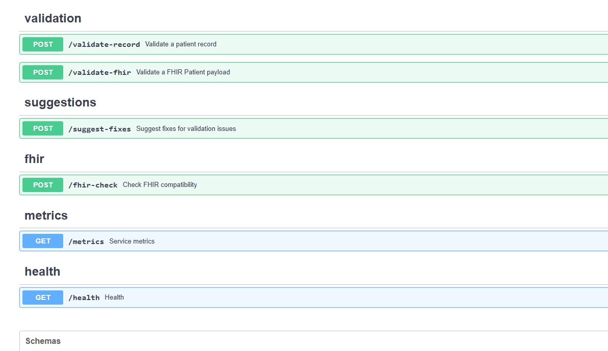
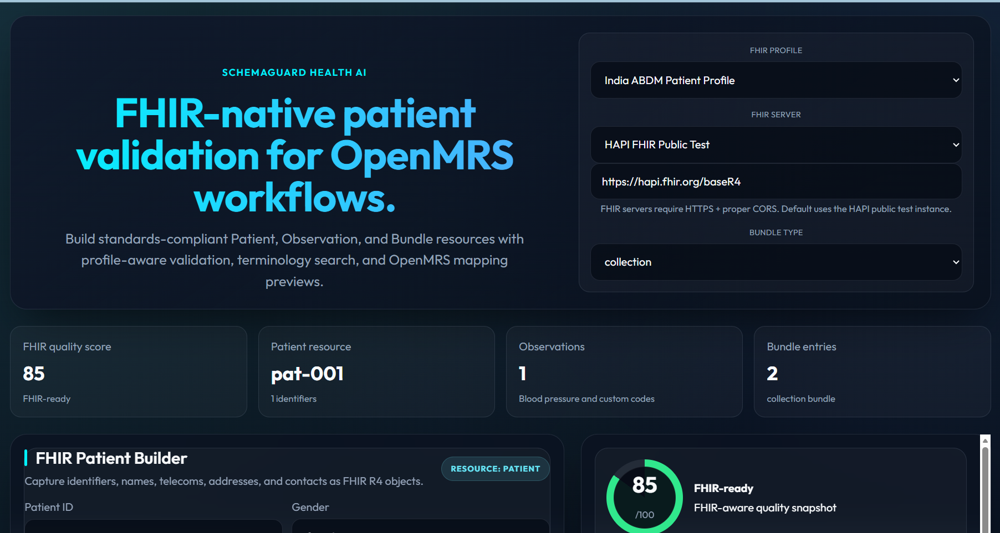
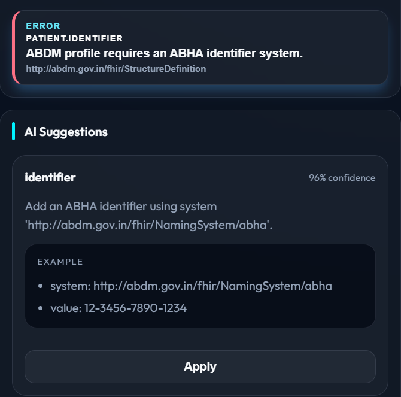

# SchemaGuard MVP — Project Report

**Title:** SchemaGuard — FHIR Validation and Suggestion Service (MVP)

**Authors:** Surya Deepak Boyina

**Date:** 29 May 2026

## Abstract

This report documents the SchemaGuard MVP, a prototype system designed to validate FHIR R4 resources and provide LLM-assisted suggestions to remediate validation issues. The system comprises a FastAPI backend exposing profile-aware validation and suggestion endpoints, and a Vite+React frontend that allows users to build patient resources, run validations, and apply suggested fixes. We describe the experimental setup used to run the system locally, present representative results (API surface, UI quality snapshot, and an example error with an AI suggestion), and discuss limitations and next steps. The report is intended as a concise academic-style summary suitable for mentor review.

## 1. Introduction

Healthcare integrations increasingly rely on FHIR profiles and local implementation guides. Manual validation is time-consuming; automated validators help identify non-conformant fields, while AI-powered suggestions can accelerate remediation. SchemaGuard combines deterministic profile-aware checks with LLM-driven suggestions to propose concrete fixes for common issues (for example, missing identifiers mandated by a national profile).

## 2. System Components

- Backend: `app/` — implemented with FastAPI. Key routes include `/validate-record`, `/validate-fhir`, `/suggest-fixes`, `/fhir-check`, `/metrics`, and `/health`. The OpenAPI UI is available at `/docs`.
- Frontend: `frontend/` — Vite + React UI. Important components live under `frontend/src/components/` and provide the Patient Builder, validation summary, and suggestion panel.
- Data flow: the frontend POSTS resources to the validation endpoints; the backend returns structured issues and optional suggestions which the UI renders and allows applying.

## 3. Experimental setup (reproduction)

The local experiment was executed on a development workstation. Reproduce with the commands below.

```bash
# Backend
source .venv/bin/activate
uvicorn app.main:app --host 0.0.0.0 --port 8000

# Frontend (new shell)
cd frontend
npm install
npm run dev -- --host 0.0.0.0
```

Access the UI at `http://localhost:5173/` and the API docs at `http://localhost:8000/docs`.

## 4. Results (representative)

Figure 1 shows the backend OpenAPI surface and confirms the primary endpoints that the frontend calls during validation and suggestion workflows.

**Figure 1.** Backend OpenAPI snapshot (endpoints used by SchemaGuard).



Figure 2 is the frontend dashboard demonstrating the FHIR quality score, patient summary, and the patient builder UI used to create and edit resources prior to validation.

**Figure 2.** Frontend dashboard and FHIR quality snapshot.



Figure 3  contains an example validation error and the LLM suggestion to add an ABHA identifier; this is representative of the combined validation+suggestion behavior.




## 5. Discussion

The system successfully identifies profile violations and returns actionable suggestions. Strengths: quick local startup, clear UI workflow, and modular backend endpoints that allow external clients to integrate. Limitations: suggestions depend on LLM quality and prompt design, and the current deployment is a local dev server (not production hardened). Additional work includes adding automated tests for typical profiles, improving suggestion confidence scoring, and containerized deployment.

## 6. Conclusion

SchemaGuard demonstrates a practical integration of profile-aware FHIR validation with AI-driven suggestions. The MVP is suitable for mentor evaluation and rapid prototyping; next steps focus on robustness and deployment.


## Appendix A — Reproduction commands and notes

- Backend dev server: `uvicorn app.main:app --host 0.0.0.0 --port 8000`
- Frontend dev server: `npm run dev -- --host 0.0.0.0` (run inside `frontend/`)
- Screenshots used in this report are located in `screenshot/`.

---

.
